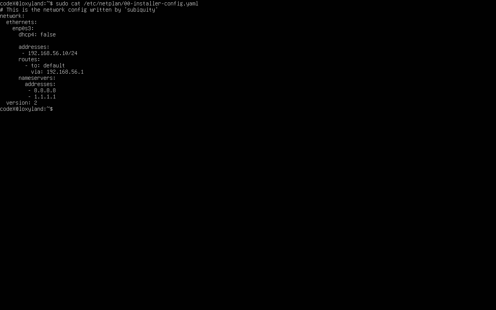
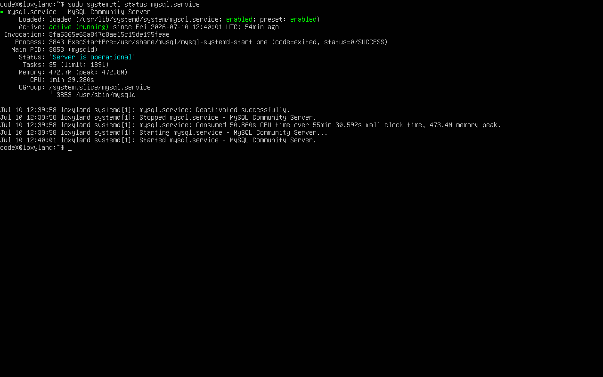
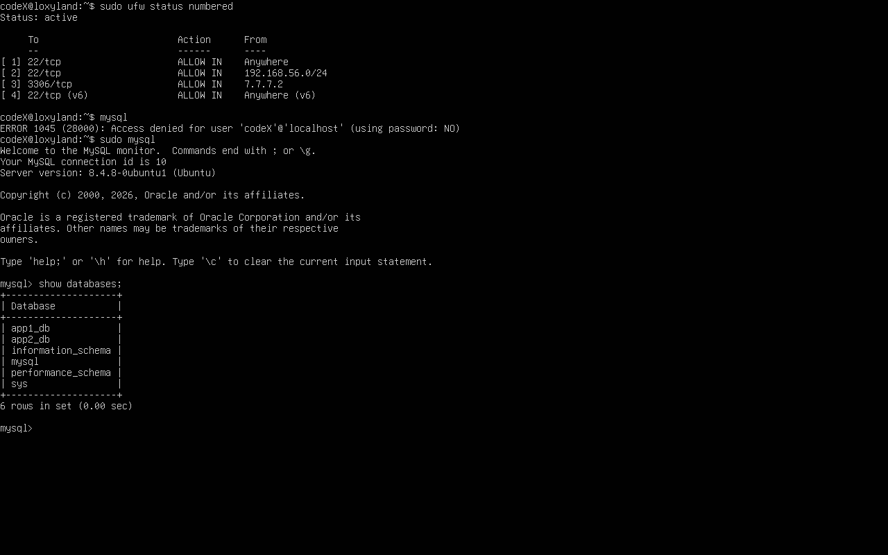
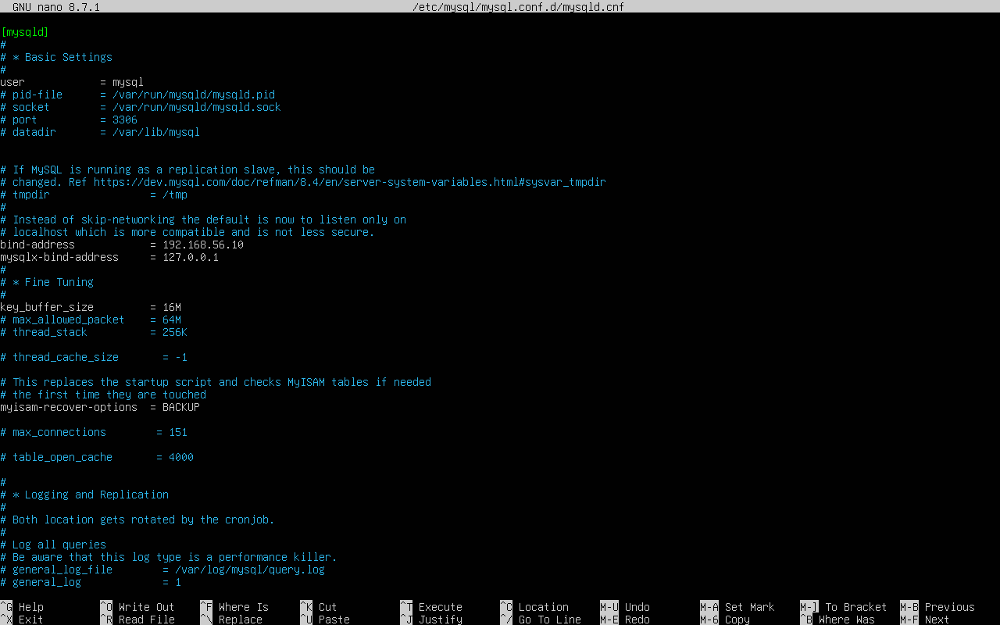
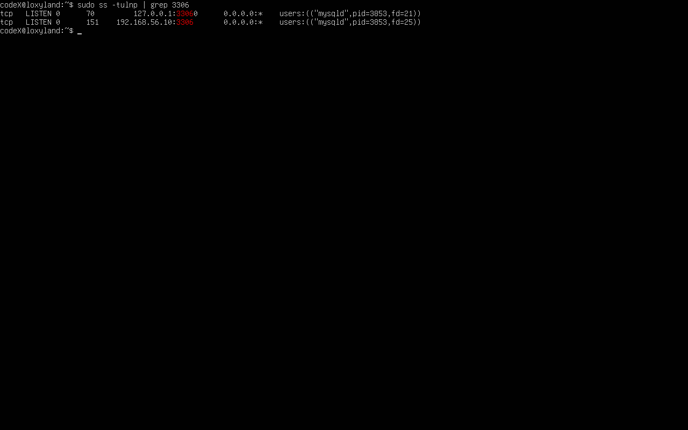
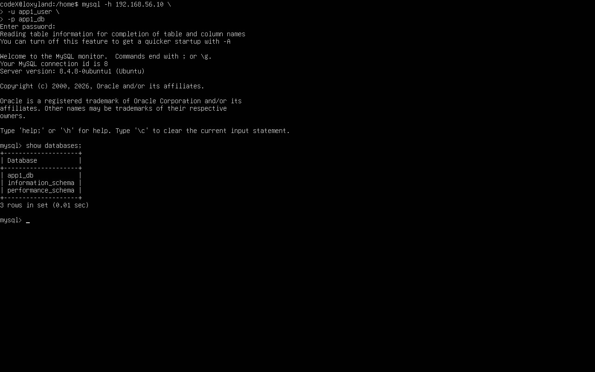

# BAB 7 - Implementasi Database Server (MySQL)

> Mata Kuliah : Virtualisasi dan Keamanan Jaringan  
> Proyek : Implementasi Arsitektur Jaringan Tersegmentasi

---

# Daftar Isi

- Tujuan
- Arsitektur Database
- Spesifikasi Server
- Konfigurasi VirtualBox
- Konfigurasi Network
- Instalasi MySQL
- Konfigurasi Database
- Konfigurasi User
- Konfigurasi Remote Access
- Konfigurasi Firewall UFW
- Pengujian
- Troubleshooting
- Kesimpulan

---

# 7.1 Tujuan

Database Server merupakan backend utama yang digunakan oleh dua aplikasi web yang berada pada zona DMZ.

Server ini memiliki beberapa tujuan utama:

- Menyimpan data aplikasi.
- Menerima koneksi hanya dari VM Ubuntu DMZ.
- Menolak akses langsung dari jaringan External.
- Menjadi backend bagi App1 dan App2.

---

# 7.2 Arsitektur Database

```

Internet
│
▼
MikroTik CHR
│
├───────────────┐
│               │
DMZ             LAN
│               │
Ubuntu DMZ      Ubuntu Database
7.7.7.2         192.168.56.10
│
│ MySQL (3306)
▼
MySQL Server

```

---

# 7.3 Spesifikasi Server

| Parameter | Nilai |
|-----------|-------|
| Operating System | Ubuntu Server 24.04 LTS |
| CPU | 2 vCPU |
| RAM | 2 GB |
| Storage | 30 GB |
| IP Address | 192.168.56.10 |
| Gateway | 192.168.56.1 |
| DNS | 8.8.8.8, 1.1.1.1 |

---

# 7.4 Konfigurasi VirtualBox

Ubuntu Database menggunakan satu buah adapter.

| Adapter | Konfigurasi |
|----------|-------------|
| Adapter 1 | Enable |
| Attached To | Internal Network |
| Name | LAN |

---

# 7.5 Konfigurasi Network

Konfigurasi menggunakan Netplan.

Lokasi file:

```text
/etc/netplan/50-cloud-init.yaml
```

Konfigurasi:

```yaml
network:
  version: 2

  ethernets:
    enp0s3:
      dhcp4: false

      addresses:
        - 192.168.56.10/24

      routes:
        - to: default
          via: 192.168.56.1

      nameservers:
        addresses:
          - 8.8.8.8
          - 1.1.1.1
```

Apply konfigurasi:

```bash
sudo netplan apply
```

---

# 7.6 Verifikasi Network

Cek IP:

```bash
ip a
```

Output:

```
192.168.56.10/24
```

Cek routing:

```bash
ip route
```

Output:

```
default via 192.168.56.1
```

Pengujian:

```bash
ping 192.168.56.1
```

Status:

✅ Berhasil

Internet:

```bash
ping google.com
```

Status:

✅ Berhasil

---

# 7.7 Instalasi MySQL

Update package.

```bash
sudo apt update

sudo apt full-upgrade -y
```

Install MySQL.

```bash
sudo apt install -y mysql-server
```

Verifikasi service.

```bash
sudo systemctl status mysql
```

Output:

```
Active: active (running)
```

Aktifkan auto-start.

```bash
sudo systemctl enable mysql
```

---

# 7.8 Secure Installation

Konfigurasi keamanan dasar.

```bash
sudo mysql_secure_installation
```

Konfigurasi yang digunakan:

| Parameter | Nilai |
|------------|--------|
| Remove anonymous user | Yes |
| Disable remote root login | Yes |
| Remove test database | Yes |
| Reload privilege | Yes |

---

# 7.9 Pembuatan Database

Masuk ke MySQL.

```bash
sudo mysql
```

Buat database.

```sql
CREATE DATABASE app1_db;
CREATE DATABASE app2_db;
```

Verifikasi.

```sql
SHOW DATABASES;
```

---

# 7.10 Pembuatan User

Membuat user khusus untuk masing-masing aplikasi.

```sql
CREATE USER 'app1_user'@'7.7.7.2'
IDENTIFIED BY 'App1@123456';

CREATE USER 'app2_user'@'7.7.7.2'
IDENTIFIED BY 'App2@123456';
```

Grant permission.

```sql
GRANT ALL PRIVILEGES
ON app1_db.*
TO 'app1_user'@'7.7.7.2';

GRANT ALL PRIVILEGES
ON app2_db.*
TO 'app2_user'@'7.7.7.2';

FLUSH PRIVILEGES;
```

Verifikasi.

```sql
SELECT user,host
FROM mysql.user;
```

---

# 7.11 Dummy Data

## Database App1

```sql
USE app1_db;

CREATE TABLE products(

id INT AUTO_INCREMENT PRIMARY KEY,

name VARCHAR(100),

price DECIMAL(10,2)

);

INSERT INTO products(name,price)

VALUES

('Keyboard Mechanical',850000),

('Mouse Wireless',250000),

('Monitor 24 Inch',2200000);
```

---

## Database App2

```sql
USE app2_db;

CREATE TABLE employees(

id INT AUTO_INCREMENT PRIMARY KEY,

fullname VARCHAR(100),

department VARCHAR(100)

);

INSERT INTO employees(fullname,department)

VALUES

('Andi Saputra','IT'),

('Budi Santoso','Finance'),

('Citra Lestari','HR');
```

---

# 7.12 Konfigurasi Remote Access

Edit file konfigurasi MySQL.

```text
/etc/mysql/mysql.conf.d/mysqld.cnf
```

Ubah.

```ini
bind-address = 127.0.0.1
```

Menjadi.

```ini
bind-address = 192.168.56.10
```

Restart service.

```bash
sudo systemctl restart mysql
```

Verifikasi.

```bash
sudo ss -tulnp | grep 3306
```

Output:

```
127.0.0.1:3306
192.168.56.10:3306
```

Hal ini menunjukkan MySQL menerima koneksi lokal serta koneksi dari jaringan LAN.

---

# 7.13 Firewall UFW

Instalasi.

```bash
sudo apt install -y ufw
```

Default policy.

```bash
sudo ufw default deny incoming

sudo ufw default allow outgoing
```

Izinkan SSH.

```bash
sudo ufw allow from 192.168.56.0/24 to any port 22 proto tcp
```

Izinkan MySQL hanya dari Ubuntu DMZ.

```bash
sudo ufw allow from 7.7.7.2 to any port 3306 proto tcp
```

Aktifkan.

```bash
sudo ufw enable
```

Verifikasi.

```bash
sudo ufw status numbered
```

Output yang diharapkan.

```
22/tcp
ALLOW
192.168.56.0/24

3306/tcp
ALLOW
7.7.7.2
```

---

# 7.14 Pengujian

## Pengujian Service

```bash
systemctl status mysql
```

✅ Berhasil

---

## Pengujian Listening Port

```bash
sudo ss -tulnp | grep 3306
```

✅ Berhasil

---

## Pengujian dari Ubuntu DMZ

```bash
mysql \
-h 192.168.56.10 \
-u app1_user \
-p
```

Status:

✅ Berhasil login.

---

## Pengujian Database

```sql
SHOW TABLES;

SELECT * FROM products;
```

Status:

✅ Berhasil.

---

# 7.15 Hasil Pengujian

| Pengujian | Status |
|------------|--------|
| Network | ✅ |
| Gateway | ✅ |
| Internet | ✅ |
| MySQL Service | ✅ |
| Database App1 | ✅ |
| Database App2 | ✅ |
| User Database | ✅ |
| Dummy Data | ✅ |
| Remote Access | ✅ |
| Firewall UFW | ✅ |
| Login dari Ubuntu DMZ | ✅ |

---

# 7.16 Troubleshooting

## Password Policy

Error:

```
ERROR 1819 (HY000)

Your password does not satisfy the current policy requirements
```

Penyebab:

Password tidak memenuhi kebijakan keamanan MySQL.

Solusi:

Menggunakan password yang memenuhi kompleksitas.

```
App1@123456
```

---

## MySQL Tidak Bisa Diakses

Penyebab:

```
bind-address
```

masih menggunakan

```
127.0.0.1
```

Solusi:

Mengubah menjadi.

```
192.168.56.10
```

Kemudian melakukan restart service.

---

## Connection Refused

Penyebab:

Firewall UFW belum mengizinkan port 3306.

Solusi:

```bash
sudo ufw allow from 7.7.7.2 to any port 3306 proto tcp
```

---

# 7.17 Lampiran Screenshot

## Konfigurasi Netplan



## Status Service MySQL



## Output `SHOW DATABASES`



## Konfigurasi `bind-address`



## Output `ss -tulnp`



## Output `ufw status numbered`


## Login MySQL dari Ubuntu DMZ



---

# 7.18 Kesimpulan

Implementasi Database Server berhasil dilakukan menggunakan MySQL Server pada Ubuntu Server yang berada di segmen LAN dengan alamat IP **192.168.56.10**.

Server dikonfigurasi menggunakan alamat IP statis melalui Netplan dan hanya menerima koneksi database dari Ubuntu Server DMZ (**7.7.7.2**) melalui port **3306**. Mekanisme ini diperkuat dengan konfigurasi firewall UFW di level sistem operasi serta aturan firewall pada Router MikroTik sehingga hanya aplikasi pada zona DMZ yang dapat mengakses database.

Dua database (**app1_db** dan **app2_db**) beserta user khusus berhasil dibuat dengan prinsip *least privilege*, masing-masing hanya memiliki hak akses pada databasenya sendiri. Seluruh pengujian konektivitas dan akses database dari Ubuntu DMZ berhasil dilakukan, sehingga Database Server siap digunakan sebagai backend bagi kedua aplikasi web pada tahap implementasi berikutnya.
