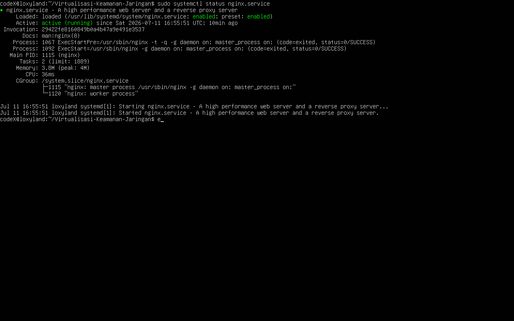
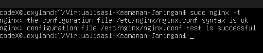
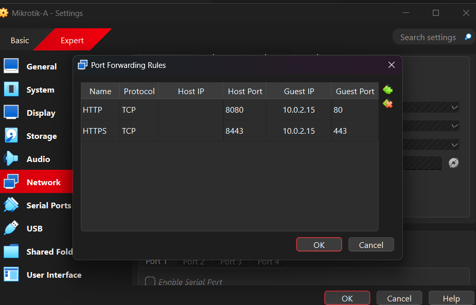
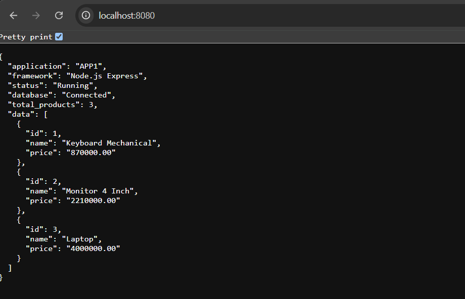
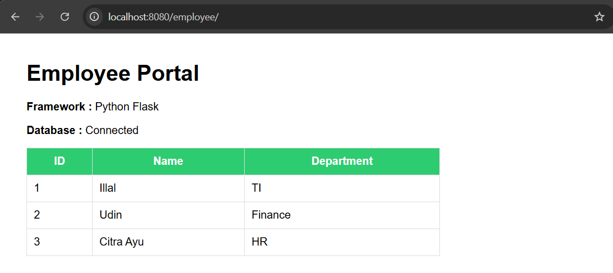
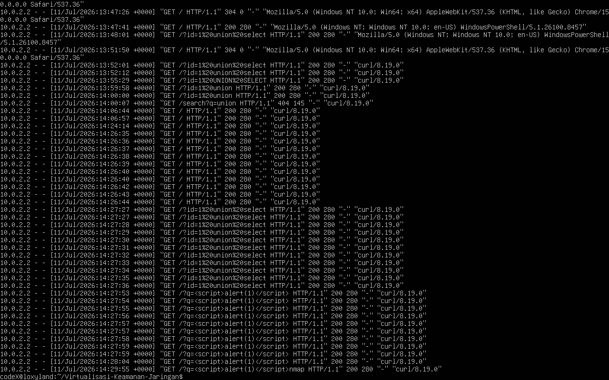
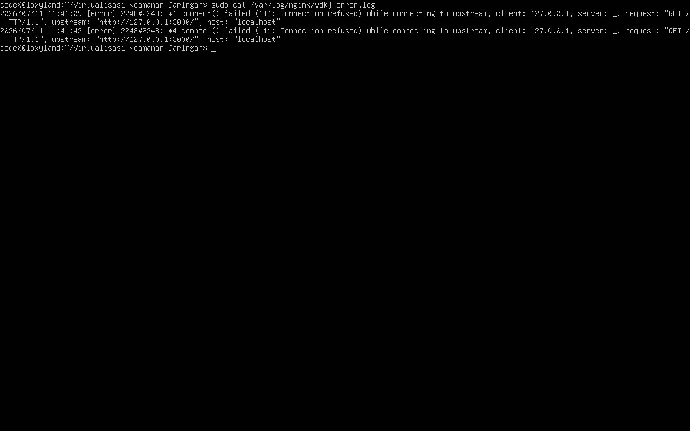

# BAB 9
# Implementasi Nginx Reverse Proxy

## 9.1 Pendahuluan

### Pengertian Reverse Proxy

Reverse Proxy adalah sebuah server yang berada di antara client dan server backend, yang menerima permintaan dari client dan meneruskannya ke server yang sesuai. Berbeda dengan forward proxy yang mewakili client, reverse proxy mewakili server.

### Fungsi Nginx sebagai Reverse Proxy

Nginx berfungsi sebagai reverse proxy yang menerima seluruh permintaan HTTP/HTTPS dari client, kemudian meneruskannya ke aplikasi yang berjalan di dalam Docker Container berdasarkan URL path yang diakses.

### Peran Reverse Proxy pada Arsitektur DMZ

Pada arsitektur DMZ, reverse proxy memiliki peran krusial:

- **Single Point of Entry**: Semua traffic masuk melalui satu pintu (port 80/443)
- **Port Hiding**: Port internal aplikasi (3000, 3001) tidak ter-expose ke luar
- **Load Balancing**: Dapat mendistribusikan beban ke beberapa server backend
- **SSL Termination**: Mengelola sertifikat SSL/TLS di satu tempat
- **Security Headers**: Menambahkan header keamanan pada setiap response

### Gambaran Implementasi pada Proyek

Implementasi ini menggunakan dua aplikasi:

- **APP1** : Node.js Express (Port 3000)
- **APP2** : Python Flask (Port 3001)

### Alasan Menggunakan Reverse Proxy

| Tanpa Reverse Proxy | Dengan Reverse Proxy |
|---------------------|---------------------|
| Port aplikasi ter-expose langsung | Port aplikasi tersembunyi |
| SSL harus dikonfigurasi di setiap app | SSL dikelola di satu tempat |
| Tidak ada logging terpusat | Logging terpusat di Nginx |
| Sulit menambahkan security headers | Security headers mudah ditambahkan |
| Tidak ada load balancing | Load balancing tersedia |

---

## 9.2 Tujuan

Implementasi Nginx Reverse Proxy bertujuan untuk:

1. **Menyediakan satu pintu akses aplikasi** — Seluruh aplikasi diakses melalui satu URL
2. **Menyembunyikan port internal aplikasi** — Port 3000 dan 3001 tidak ter-expose
3. **Mempermudah manajemen layanan** — Konfigurasi terpusat di Nginx
4. **Menambahkan HTTPS** — Enkripsi data antara client dan server
5. **Menambahkan Security Header** — Perlindungan tambahan dari serangan web
6. **Monitoring** — Access Log dan Error Log untuk analisis

---

## 9.3 Dasar Teori

### Nginx

**Pengertian**: Nginx (engine-x) adalah web server open-source yang juga berfungsi sebagai reverse proxy, load balancer, dan HTTP cache.

**Fungsi**:
- Web server untuk menyajikan konten statis
- Reverse proxy untuk meneruskan request ke backend
- Load balancer untuk distribusi beban
- HTTP cache untuk meningkatkan performa

**Kelebihan**:
- Konsumsi memori rendah
- Arsitektur event-driven (asynchronous)
- High concurrency dengan sedikit proses
- Konfigurasi fleksibel dan mudah dipahami

### Reverse Proxy

**Cara Kerja**:

```text
Client → Reverse Proxy → Server Backend
   ↑                          ↓
   ←──────── Response ─────────←
```

**Perbedaan Reverse Proxy dan Forward Proxy**:

| Aspek | Forward Proxy | Reverse Proxy |
|-------|---------------|---------------|
| Mewakili | Client | Server |
| Tujuan | Akses internet | Distribusi traffic |
| Pengetahuan | Server tidak tahu client | Client tidak tahu server |
| Penggunaan | Bypass blokir, anonimitas | Load balancing, keamanan |

**Keuntungan Menggunakan Reverse Proxy**:
- Keamanan: Server backend tidak ter-expose
- Performa: Caching dan compression
- Skalabilitas: Load balancing ke beberapa server
- Monitoring: Logging terpusat

### HTTPS

**Pengertian SSL/TLS**: SSL (Secure Sockets Layer) dan TLS (Transport Layer Security) adalah protokol kriptografi yang menyediakan komunikasi yang aman melalui jaringan.

**Fungsi HTTPS**:
- Enkripsi data saat transmisi
- Autentikasi server
- Integritas data
- Mencegah man-in-the-middle attack

**Self-Signed Certificate**: Sertifikat SSL yang ditandatangani oleh server itu sendiri, bukan oleh Certificate Authority (CA).

**Perbedaan Self-Signed dan CA Certificate**:

| Aspek | Self-Signed | CA Certificate |
|-------|-------------|----------------|
| Biaya | Gratis | Berbayar |
| Kepercayaan | Browser menampilkan warning | Browser percaya |
| Penggunaan | Development/Testing | Production |
| Validasi | Tidak ada | Tervalidasi oleh CA |

---

## 9.4 Topologi Implementasi

```text
┌─────────────────────────────────────────────────────────────┐
│                      Windows Host                           │
│                                                             │
│  http://localhost:8080  ──→  HTTP                           │
│  https://localhost:8443 ──→  HTTPS                          │
└──────────────────────────┬──────────────────────────────────┘
                           │
              VirtualBox NAT Port Forwarding
              ┌────────────┴────────────┐
              │  8080 → 80 (HTTP)       │
              │  8443 → 443 (HTTPS)     │
              └────────────┬────────────┘
                           │
┌──────────────────────────┴──────────────────────────────────┐
│                    Ubuntu Server DMZ                         │
│                      IP: 7.7.7.2                             │
│                                                             │
│  ┌─────────────────────────────────────────────────────┐   │
│  │                  Nginx :80/:443                      │   │
│  │                                                     │   │
│  │   location /         → proxy_pass → APP1 :3000      │   │
│  │   location /employee → proxy_pass → APP2 :3001      │   │
│  └─────────────────────────────────────────────────────┘   │
│                           │                                 │
│         ┌─────────────────┴─────────────────┐              │
│         │                                   │              │
│         ▼                                   ▼              │
│  ┌─────────────┐                    ┌─────────────┐        │
│  │   APP1      │                    │   APP2      │        │
│  │ Node.js     │                    │ Python Flask│        │
│  │ Port 3000   │                    │ Port 3001   │        │
│  └─────────────┘                    └─────────────┘        │
│                                                             │
└─────────────────────────────────────────────────────────────┘
```

### Penjelasan Komponen

| Komponen | Fungsi |
|----------|--------|
| **Windows Host** | Client yang mengakses aplikasi melalui browser |
| **VirtualBox NAT** | Mode jaringan VM dengan Port Forwarding |
| **Ubuntu Server DMZ** | Server yang menjalankan Nginx dan Docker |
| **Nginx** | Reverse proxy yang meneruskan request ke aplikasi |
| **APP1** | Aplikasi Node.js Express (Port 3000) |
| **APP2** | Aplikasi Python Flask (Port 3001) |

---

## 9.5 Arsitektur Reverse Proxy

### Diagram Alur Request

```text
Client Request                    Nginx                      Backend
      │                             │                           │
      │  GET / HTTP/1.1             │                           │
      │────────────────────────────→│                           │
      │                             │  proxy_pass :3000         │
      │                             │──────────────────────────→│
      │                             │                           │
      │                             │  HTTP/1.1 200 OK          │
      │                             │←──────────────────────────│
      │  HTTP/1.1 200 OK            │                           │
      │←────────────────────────────│                           │
```

### Flow Request HTTP

1. Client mengirim request ke `http://localhost:8080/`
2. VirtualBox meneruskan ke Nginx di port 80
3. Nginx menganalisis URL path
4. Path `/` → proxy_pass ke APP1 (port 3000)
5. Path `/employee/` → proxy_pass ke APP2 (port 3001)
6. Nginx menerima response dari backend
7. Nginx menambahkan security headers
8. Response dikirim kembali ke client

### Flow Request HTTPS

1. Client mengirim request ke `https://localhost:8443/`
2. VirtualBox meneruskan ke Nginx di port 443
3. Nginx melakukan SSL handshake
4. SSL termination terjadi di Nginx
5. Request diteruskan ke backend (HTTP biasa)
6. Response dienkripsi kembali sebelum dikirim ke client

### Alur Request ke APP1

```text
GET / HTTP/1.1
Host: localhost:8080

→ Nginx menerima request
→ Location / cocok
→ proxy_pass http://127.0.0.1:3000
→ APP1 memproses request
→ Response dikirim kembali
```

### Alur Request ke APP2

```text
GET /employee/ HTTP/1.1
Host: localhost:8080

→ Nginx menerima request
→ Location /employee/ cocok
→ proxy_pass http://127.0.0.1:3001/
→ APP2 memproses request
→ Response dikirim kembali
```

---

## 9.6 Port Forwarding

### Mengapa Windows Tidak Dapat Mengakses 7.7.7.2

VirtualBox menggunakan mode **NAT** untuk adapter jaringan VM. Dalam mode NAT:

- VM berada di jaringan internal VirtualBox
- IP `7.7.7.2` adalah alamat internal yang hanya dapat diakses dari dalam VM
- Windows Host tidak dapat mengakses langsung alamat tersebut

### Penjelasan Internal Network pada VirtualBox

```text
┌─────────────────────────────────────────┐
│           VirtualBox NAT Network        │
│                                         │
│   VM Ubuntu    7.7.7.2                  │
│       │                                 │
│       │ NAT Interface                   │
│       │                                 │
│   VirtualBox NAT Engine                 │
│       │                                 │
│   Host Interface                        │
│       │                                 │
│   Windows Host  127.0.0.1               │
└─────────────────────────────────────────┘
```

### Alasan Menggunakan Port Forwarding

- Akses dari Windows ke VM tanpa mengubah mode jaringan
- Tidak memerlukan konfigurasi jaringan tambahan
- Port spesifik dapat di-forward ke port tertentu di VM

### Konfigurasi Port Forwarding

| Protocol | Host IP | Host Port | Guest IP | Guest Port | Keterangan |
|----------|---------|-----------|----------|------------|------------|
| TCP | 127.0.0.1 | 8080 | - | 80 | HTTP → Nginx |
| TCP | 127.0.0.1 | 8443 | - | 443 | HTTPS → Nginx |

### Mapping Port

```text
localhost:8080  →  VM Port 80  →  Nginx HTTP
localhost:8443  →  VM Port 443 →  Nginx HTTPS
```

---

## 9.7 Instalasi Nginx

### Update Repository

```bash
sudo apt update
```

### Install Nginx

```bash
sudo apt install nginx -y
```

### Enable Service

```bash
sudo systemctl enable nginx
```

### Start Service

```bash
sudo systemctl start nginx
```

### Verifikasi Service

```bash
sudo systemctl status nginx
```

**Status yang diharapkan:**

```text
● nginx.service - A high performance web server and a reverse proxy server
     Loaded: loaded (/lib/systemd/system/nginx.service; enabled; vendor preset: enabled)
     Active: active (running) since ...
```

---

## 9.8 Implementasi HTTPS

### Membuat Direktori SSL

```bash
sudo mkdir -p /etc/nginx/ssl
```

### Generate Self-Signed Certificate

```bash
sudo openssl req -x509 -nodes -days 365 -newkey rsa:2048 \
  -keyout /etc/nginx/ssl/nginx.key \
  -out /etc/nginx/ssl/nginx.crt \
  -subj "/C=ID/ST=DKI/L=Jakarta/O=VDKJ/CN=localhost"
```

### Penjelasan Script

| Parameter | Fungsi |
|-----------|--------|
| `-x509` | Membuat self-signed certificate |
| `-nodes` | Tidak menggunakan passphrase |
| `-days 365` | Masa berlaku 1 tahun |
| `-newkey rsa:2048` | Key size 2048 bit |
| `-keyout` | Lokasi private key |
| `-out` | Lokasi certificate |
| `-subj` | Informasi subjek certificate |

### Lokasi Penyimpanan Certificate

```text
/etc/nginx/ssl/nginx.crt    ← Certificate
/etc/nginx/ssl/nginx.key    ← Private Key
```

### Permission Certificate

```bash
sudo chmod 600 /etc/nginx/ssl/nginx.key
sudo chmod 644 /etc/nginx/ssl/nginx.crt
```

### Verifikasi Certificate

```bash
sudo openssl x509 -in /etc/nginx/ssl/nginx.crt -text -noout
```

---

## 9.9 Konfigurasi Nginx

### Lokasi File Konfigurasi

```text
/etc/nginx/sites-available/vdkj
```

### Penjelasan Setiap Directive

#### listen

```nginx
listen 80;
listen 443 ssl;
```

- `listen 80`: Mendengarkan port HTTP
- `listen 443 ssl`: Mendengarkan port HTTPS dengan SSL

#### server_name

```nginx
server_name _;
```

Menerima request untuk semua domain (wildcard).

#### ssl_certificate & ssl_certificate_key

```nginx
ssl_certificate /etc/nginx/ssl/nginx.crt;
ssl_certificate_key /etc/nginx/ssl/nginx.key;
```

Lokasi file certificate dan private key SSL.

#### proxy_pass

```nginx
proxy_pass http://127.0.0.1:3000;
```

Meneruskan request ke backend pada port tertentu.

#### proxy_set_header

```nginx
proxy_set_header Host $host;
proxy_set_header X-Real-IP $remote_addr;
proxy_set_header X-Forwarded-For $proxy_add_x_forwarded_for;
proxy_set_header X-Forwarded-Proto $scheme;
```

Menambahkan header informasi ke backend.

#### access_log & error_log

```nginx
access_log /var/log/nginx/vdkj_access.log;
error_log /var/log/nginx/vdkj_error.log;
```

Lokasi file log akses dan error.

#### add_header

```nginx
add_header X-Frame-Options "SAMEORIGIN" always;
add_header X-Content-Type-Options "nosniff" always;
add_header Referrer-Policy "strict-origin-when-cross-origin" always;
```

Menambahkan security header pada response.

#### server_tokens

```nginx
server_tokens off;
```

Menyembunyikan versi Nginx dari response.

### HTTP Redirect ke HTTPS

```nginx
server {
    listen 80;
    server_name _;
    return 301 https://$host$request_uri;
}
```

Semua request HTTP di-redirect ke HTTPS.

### Reverse Proxy APP1

```nginx
location / {
    proxy_pass http://127.0.0.1:3000;
    proxy_http_version 1.1;
    proxy_set_header Host $host;
    proxy_set_header X-Real-IP $remote_addr;
    proxy_set_header X-Forwarded-For $proxy_add_x_forwarded_for;
    proxy_set_header X-Forwarded-Proto $scheme;
}
```

### Reverse Proxy APP2

```nginx
location /employee/ {
    proxy_pass http://127.0.0.1:3001/;
    proxy_http_version 1.1;
    proxy_set_header Host $host;
    proxy_set_header X-Real-IP $remote_addr;
    proxy_set_header X-Forwarded-For $proxy_add_x_forwarded_for;
    proxy_set_header X-Forwarded-Proto $scheme;
}
```

### Konfigurasi Lengkap

```nginx
# HTTP Redirect ke HTTPS
server {
    listen 80;
    server_name _;
    return 301 https://$host$request_uri;
}

# HTTPS Server
server {
    listen 443 ssl;
    server_name _;

    # SSL Certificate
    ssl_certificate /etc/nginx/ssl/nginx.crt;
    ssl_certificate_key /etc/nginx/ssl/nginx.key;

    # SSL Settings
    ssl_protocols TLSv1.2 TLSv1.3;
    ssl_ciphers HIGH:!aNULL:!MD5;
    ssl_prefer_server_ciphers on;

    # Logging
    access_log /var/log/nginx/vdkj_access.log;
    error_log /var/log/nginx/vdkj_error.log;

    # Security Headers
    add_header X-Frame-Options "SAMEORIGIN" always;
    add_header X-Content-Type-Options "nosniff" always;
    add_header Referrer-Policy "strict-origin-when-cross-origin" always;
    add_header Strict-Transport-Security "max-age=31536000; includeSubDomains" always;

    # Hide Nginx Version
    server_tokens off;

    # Reverse Proxy APP1
    location / {
        proxy_pass http://127.0.0.1:3000;
        proxy_http_version 1.1;
        proxy_set_header Host $host;
        proxy_set_header X-Real-IP $remote_addr;
        proxy_set_header X-Forwarded-For $proxy_add_x_forwarded_for;
        proxy_set_header X-Forwarded-Proto $scheme;
    }

    # Reverse Proxy APP2
    location /employee/ {
        proxy_pass http://127.0.0.1:3001/;
        proxy_http_version 1.1;
        proxy_set_header Host $host;
        proxy_set_header X-Real-IP $remote_addr;
        proxy_set_header X-Forwarded-For $proxy_add_x_forwarded_for;
        proxy_set_header X-Forwarded-Proto $scheme;
    }
}
```

---

## 9.10 Aktivasi Konfigurasi

### Membuat Symbolic Link

```bash
sudo ln -s /etc/nginx/sites-available/vdkj /etc/nginx/sites-enabled/
```

### Menghapus Default Site

```bash
sudo rm /etc/nginx/sites-enabled/default
```

### Validasi nginx -t

```bash
sudo nginx -t
```

**Output yang diharapkan:**

```text
nginx: the configuration file /etc/nginx/nginx.conf syntax is ok
nginx: configuration file /etc/nginx/nginx.conf test is successful
```

### Restart Service

```bash
sudo systemctl restart nginx
```

---

## 9.11 Pengujian

### HTTP

**Akses localhost:8080:**

```bash
curl -I http://localhost:8080
```

**Hasil:**

```text
HTTP/1.1 301 Moved Permanently
Location: https://localhost:8443/
```

HTTP di-redirect ke HTTPS.

### HTTPS

**Akses localhost:8443:**

```bash
curl -k -I https://localhost:8443
```

**Verifikasi SSL:**

```bash
curl -k https://localhost:8443
```

### APP1

**Akses:**

```text
https://localhost:8443/
```

**Expected:**

- Halaman APP1 tampil
- Database Connected
- URL tidak berubah (tetap https://localhost:8443/)

### APP2

**Akses:**

```text
https://localhost:8443/employee/
```

**Expected:**

- Halaman Employee Portal tampil
- Database Connected

### Security Header

**Cek header:**

```bash
curl -k -I https://localhost:8443
```

**Header yang muncul:**

```text
HTTP/1.1 200 OK
Server: nginx
X-Frame-Options: SAMEORIGIN
X-Content-Type-Options: nosniff
Referrer-Policy: strict-origin-when-cross-origin
Strict-Transport-Security: max-age=31536000; includeSubDomains
```

### Access Log

**Melihat log:**

```bash
sudo tail -f /var/log/nginx/vdkj_access.log
```

**Contoh request:**

```text
127.0.0.1 - - [11/Jul/2026:14:27:27 +0000] "GET / HTTP/1.1" 200 280 "-" "curl/8.19.0"
127.0.0.1 - - [11/Jul/2026:14:27:27 +0000] "GET /employee/ HTTP/1.1" 200 280 "-" "curl/8.19.0"
```

### Error Log

**Melihat error:**

```bash
sudo tail -f /var/log/nginx/vdkj_error.log
```

---

## 9.12 Troubleshooting

### localhost:8080 tidak dapat diakses

**Penyebab:**

- Port Forwarding belum dibuat
- Nginx belum berjalan
- Firewall memblokir port

**Solusi:**

```bash
sudo systemctl status nginx
sudo systemctl restart nginx
```

Periksa aturan Port Forwarding VirtualBox.

### localhost:8443 tidak dapat diakses

**Penyebab:**

- SSL belum dikonfigurasi
- Port 443 belum di-forward

**Solusi:**

```bash
sudo nginx -t
sudo systemctl restart nginx
```

### Browser menampilkan "Your connection is not private"

**Penyebab:**

- Menggunakan Self-Signed Certificate
- Browser tidak mempercayai certificate

**Solusi:**

- Klik "Advanced" → "Proceed to localhost (unsafe)"
- Atau tambahkan certificate ke trusted store

### nginx -t gagal

**Penyebab:**

- Syntax konfigurasi salah
- File certificate tidak ditemukan

**Solusi:**

```bash
sudo nginx -t
```

Periksa syntax konfigurasi.

### 502 Bad Gateway

**Penyebab:**

- APP1/APP2 belum berjalan
- Container berhenti
- Port backend salah

**Solusi:**

```bash
docker ps
docker compose logs
```

### APP1 tidak dapat diakses

**Pastikan:**

```bash
docker ps
curl -k https://localhost:8443/
```

Jika gagal, periksa container Node.js.

### APP2 tidak dapat diakses

**Pastikan:**

```bash
docker ps
curl -k https://localhost:8443/employee/
```

Jika gagal, periksa container Flask.

### Access Log kosong

**Pastikan file:**

```text
/var/log/nginx/vdkj_access.log
```

memiliki permission yang benar dan request benar-benar melewati Nginx.

### Error Log kosong

**Pastikan:**

```bash
sudo tail -f /var/log/nginx/vdkj_error.log
```

Jika kosong, tidak ada error yang terjadi.

### SSL Certificate tidak ditemukan

**Pastikan:**

```bash
ls -la /etc/nginx/ssl/
```

File `nginx.crt` dan `nginx.key` harus ada.

### Redirect HTTP gagal

**Pastikan:**

```nginx
server {
    listen 80;
    server_name _;
    return 301 https://$host$request_uri;
}
```

Konfigurasi redirect sudah benar.

---

## 9.13 Hasil Implementasi

| Komponen | Status | Keterangan |
|----------|--------|------------|
| Install Nginx | ✅ | Berhasil |
| HTTPS | ✅ | Self-Signed Certificate |
| HTTP Redirect | ✅ | 80 → 443 |
| Reverse Proxy APP1 | ✅ | / → :3000 |
| Reverse Proxy APP2 | ✅ | /employee/ → :3001 |
| Security Headers | ✅ | X-Frame-Options, X-Content-Type-Options, Referrer-Policy, HSTS |
| Access Log | ✅ | /var/log/nginx/vdkj_access.log |
| Error Log | ✅ | /var/log/nginx/vdkj_error.log |
| Port Forwarding | ✅ | 8080→80, 8443→443 |

### Analisis Hasil

Implementasi Nginx Reverse Proxy dengan HTTPS berhasil dilakukan. Seluruh komponen berfungsi sesuai yang diharapkan:

1. **Keamanan**: HTTPS aktif dengan Self-Signed Certificate
2. **Akses Terpusat**: Semua aplikasi diakses melalui satu domain
3. **Port Hidden**: Port internal (3000, 3001) tidak ter-expose
4. **Logging**: Access log dan error log berfungsi
5. **Security Headers**: Seluruh header keamanan aktif

### Evaluasi Keamanan

| Aspek | Status | Catatan |
|-------|--------|---------|
| HTTPS | ✅ | Self-Signed (development) |
| Security Headers | ✅ | Lengkap |
| Port Hidden | ✅ | Tidak ter-expose |
| Logging | ✅ | Aktif |
| SSL Version | ✅ | TLS 1.2/1.3 |

---

## 9.14 Dokumentasi Screenshot

### Status Nginx



### Hasil nginx -t



### VirtualBox Port Forwarding



### APP1 melalui localhost:8443



### APP2 melalui localhost:8443/employee/



### Access Log



### Error Log



---

## 9.15 Kesimpulan

Implementasi Nginx Reverse Proxy berhasil dilakukan pada Ubuntu Server DMZ. Seluruh implementasi mencakup:

### Keuntungan Menggunakan Reverse Proxy

1. **Keamanan**: Port internal aplikasi tidak ter-expose ke luar
2. **Manajemen Terpusat**: Konfigurasi semua aplikasi di satu tempat
3. **Flexibility**: Mudah menambahkan aplikasi baru
4. **Performance**: Caching dan optimization tersedia

### Keuntungan HTTPS

1. **Enkripsi**: Data terenkripsi saat transmisi
2. **Autentikasi**: Server terverifikasi
3. **Integritas**: Data tidak dimanipulasi
4. **Kepercayaan**: Browser menampilkan ikon gembok

### Keuntungan Security Header

1. **X-Frame-Options**: Mencegah Clickjacking
2. **X-Content-Type-Options**: Mencegah MIME Sniffing
3. **Referrer-Policy**: Membatasi informasi Referrer
4. **HSTS**: Memaksa HTTPS

### Kesesuaian dengan Topologi Proyek

Implementasi sesuai dengan arsitektur DMZ yang dirancang:

- Nginx berada di DMZ sebagai single point of entry
- Aplikasi berjalan di Docker Container
- Database diakses dari DMZ ke LAN
- Seluruh traffic terenkripsi melalui HTTPS
