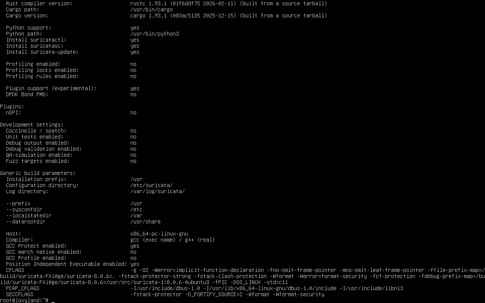
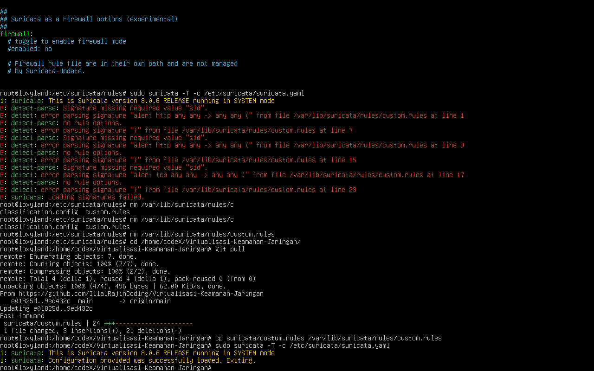
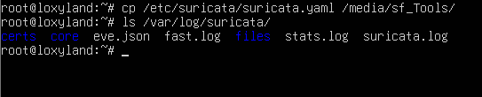

# BAB 10
# Implementasi Suricata IDS

## 10.1 Pendahuluan

Pada tahap ini dilakukan implementasi **Suricata Intrusion Detection System (IDS)** pada Ubuntu Server yang berada di segmen DMZ. Suricata digunakan untuk memonitor lalu lintas HTTP menuju web server dan menghasilkan alert apabila ditemukan pola serangan yang sesuai dengan rule.

Implementasi menggunakan **Suricata 8** dalam mode IDS (monitoring), sehingga tidak memblokir trafik tetapi mencatat seluruh aktivitas ke dalam log `eve.json`.

Pada proyek ini Suricata ditempatkan pada server yang sama dengan Nginx dan aplikasi Docker.

---

# 10.2 Tujuan

Implementasi Suricata bertujuan untuk:

- Memonitor trafik HTTP menuju aplikasi.
- Mendeteksi SQL Injection.
- Mendeteksi Cross Site Scripting (XSS).
- Mencatat alert ke file `eve.json`.
- Membantu administrator melakukan analisis keamanan.

Catatan:

Pengujian Port Scan **tidak dijadikan hasil utama** karena lingkungan menggunakan **VirtualBox NAT + Port Forwarding**, sehingga pola SYN Scan dari Windows Host tidak selalu diteruskan ke guest sebagaimana pada jaringan fisik.

---

# 10.3 Arsitektur

```text
Windows Host
      │
http://localhost:8080
      │
VirtualBox NAT Port Forwarding
      │
Ubuntu Server DMZ
      │
┌──────────────────────────────┐
│          Suricata            │
│          Nginx :80           │
│                              │
│  ┌────────────┐ ┌──────────┐ │
│  │ APP1:3000  │ │APP2:3001 │ │
│  └────────────┘ └──────────┘ │
└──────────────────────────────┘
```

---

# 10.4 Instalasi

```bash
sudo apt update
sudo apt install suricata suricata-update -y
```

Verifikasi:

```bash
suricata --build-info
```

---

# 10.5 Menentukan Interface

Melihat interface:

```bash
ip -br addr
```

Interface yang digunakan:

```text
enp0s3
```

Konfigurasi pada `/etc/suricata/suricata.yaml`:

```yaml
af-packet:
  - interface: enp0s3
```

---

# 10.6 Community Rules

Mengunduh rule bawaan:

```bash
sudo suricata-update
```

Rule tersimpan pada:

```text
/var/lib/suricata/rules/suricata.rules
```

---

# 10.7 Konfigurasi Rule

Pastikan pada `suricata.yaml`:

```yaml
default-rule-path: /var/lib/suricata/rules

rule-files:
  - suricata.rules
  - custom.rules
```

Custom rule disimpan pada:

```text
/var/lib/suricata/rules/custom.rules
```

---

# 10.8 Custom Rules

File: `/var/lib/suricata/rules/custom.rules`

```rules
alert http any any -> any any (msg:"VDKJ SQL Injection Attempt"; http.uri; content:"union"; nocase; sid:1000001; rev:2;)

alert http any any -> any any (msg:"VDKJ XSS Attempt"; http.uri; content:"<script>"; nocase; sid:1000002; rev:2;)

alert tcp any any -> any any (msg:"VDKJ Port Scan"; flags:S; threshold:type both,track by_src,count 20,seconds 10; sid:1000003; rev:2;)
```

| Rule | Fungsi |
|------|--------|
| SID 1000001 | Mendeteksi kata **union** pada URI HTTP (SQL Injection) |
| SID 1000002 | Mendeteksi payload **\<script\>** pada URI HTTP (XSS) |
| SID 1000003 | Mendeteksi Port Scan (20+ SYN dalam 10 detik) |

---

# 10.9 Validasi Konfigurasi

```bash
sudo suricata -T -c /etc/suricata/suricata.yaml
```

Output yang diharapkan:

```text
Configuration provided was successfully loaded.
```

Restart service:

```bash
sudo systemctl restart suricata
sudo systemctl enable suricata
sudo systemctl status suricata
```

---

# 10.10 Monitoring Log

Folder log:

```text
/var/log/suricata/
```

File penting:

- eve.json
- fast.log
- stats.log
- suricata.log

Monitoring realtime:

```bash
sudo tail -f /var/log/suricata/eve.json
```

Melihat alert saja:

```bash
sudo grep '"event_type":"alert"' /var/log/suricata/eve.json
```

---

# 10.11 Pengujian SQL Injection

Request dari Windows Host:

```bash
curl "http://localhost:8080/?id=1%20union%20select"
```

Expected:

```text
VDKJ SQL Injection Attempt
```

Alert muncul pada `eve.json`.

---

# 10.12 Pengujian XSS

```bash
curl "http://localhost:8080/?q=<script>alert(1)</script>"
```

Expected:

```text
VDKJ XSS Attempt
```

Alert berhasil tercatat pada `eve.json`.

---

# 10.13 Isi eve.json

Contoh alert SQL Injection pada `eve.json`:

```json
{"timestamp":"2026-07-11T14:27:27.114803+0000","flow_id":2084191590822923,"in_iface":"enp0s3","event_type":"alert","src_ip":"10.0.2.2","src_port":64217,"dest_ip":"7.7.7.2","dest_port":80,"proto":"TCP","ip_v":4,"pkt_src":"wire/pcap","tx_id":0,"alert":{"action":"allowed","gid":1,"signature_id":1000001,"rev":2,"signature":"VDKJ SQL Injection Attempt","category":"","severity":3},"http":{"hostname":"localhost","http_port":8080,"url":"/?id=1%20union%20select","http_user_agent":"curl/8.19.0","http_method":"GET","protocol":"HTTP/1.1","status":200}}
```

Contoh alert XSS pada `eve.json`:

```json
{"timestamp":"2026-07-11T14:27:53.769655+0000","flow_id":336972603945481,"in_iface":"enp0s3","event_type":"alert","src_ip":"10.0.2.2","src_port":64240,"dest_ip":"7.7.7.2","dest_port":80,"proto":"TCP","ip_v":4,"pkt_src":"wire/pcap","tx_id":0,"alert":{"action":"allowed","gid":1,"signature_id":1000002,"rev":2,"signature":"VDKJ XSS Attempt","category":"","severity":3},"http":{"hostname":"localhost","http_port":8080,"url":"/?q=<script>alert(1)</script>","http_user_agent":"curl/8.19.0","http_method":"GET","protocol":"HTTP/1.1","status":200}}
```

Contoh alert Port Scan pada `eve.json`:

```json
{"timestamp":"2026-07-11T16:04:59.952780+0000","flow_id":995934314741113,"in_iface":"enp0s3","event_type":"alert","src_ip":"7.7.7.2","src_port":53368,"dest_ip":"20.205.243.166","dest_port":443,"proto":"TCP","ip_v":4,"pkt_src":"wire/pcap","alert":{"action":"allowed","gid":1,"signature_id":1000003,"rev":2,"signature":"VDKJ Port Scan","category":"","severity":3}}
```

---

# 10.14 Referensi Konfigurasi

File konfigurasi yang digunakan:

| File | Lokasi | Fungsi |
|------|--------|--------|
| suricata.yaml | `/etc/suricata/suricata.yaml` | Konfigurasi utama Suricata |
| custom.rules | `/var/lib/suricata/rules/custom.rules` | Rule custom (SQL Injection, XSS, Port Scan) |
| eve.json | `/var/log/suricata/eve.json` | Log event dalam format JSON |

---

# 10.15 Hasil Implementasi

| Komponen | Status |
|----------|--------|
| Install Suricata | ✅ |
| Community Rules | ✅ |
| Custom Rules | ✅ |
| Monitoring HTTP | ✅ |
| SQL Injection Detection | ✅ |
| XSS Detection | ✅ |
| eve.json Logging | ✅ |

---

# 10.16 Troubleshooting

## `suricata -T` gagal

Periksa syntax `suricata.yaml` dan `custom.rules`.

---

## Error `Signature missing required value "sid"`

Tambahkan parameter:

```text
sid:<id>;
rev:<versi>;
```

pada setiap rule.

---

## `custom.rules` tidak terbaca

Pastikan file berada di:

```text
/var/lib/suricata/rules/custom.rules
```

dan `rule-files` berisi:

```yaml
- custom.rules
```

---

## Salah penamaan file

Pastikan menggunakan:

```text
custom.rules
```

bukan:

```text
costum.rules
```

---

## `eve.json` hanya berisi `stats`

Hal ini berarti belum ada request yang cocok dengan rule.

Lakukan pengujian SQL Injection atau XSS menggunakan URL yang telah ditentukan.

---

## HTTP terdeteksi tetapi Alert tidak muncul

Periksa:

- keyword `http.uri`
- `content`
- `nocase`

Restart Suricata setelah mengubah rule.

---

## Windows tidak dapat mengakses 7.7.7.2

Normal.

Lingkungan menggunakan VirtualBox NAT + Port Forwarding.

Gunakan:

```text
http://localhost:8080/
```

---

## Port Scan tidak terdeteksi

Pada topologi ini, pengujian Port Scan dari Windows melalui NAT tidak dijadikan acuan utama karena pola SYN Scan dapat berubah akibat proses NAT.

Untuk pengujian yang ideal gunakan VM lain pada jaringan Internal Network/DMZ.

---

# 10.17 Screenshot

## Hasil suricata --build-info



## Hasil suricata -T



## Isi folder /var/log/suricata



---

# 10.18 Kesimpulan

Suricata berhasil diimplementasikan sebagai Intrusion Detection System pada Ubuntu Server DMZ. IDS mampu memonitor lalu lintas HTTP yang diteruskan oleh Nginx menuju aplikasi Docker dan berhasil mendeteksi pola SQL Injection serta Cross Site Scripting menggunakan custom rule. Seluruh alert tercatat pada file `eve.json` sehingga administrator dapat melakukan monitoring dan analisis terhadap aktivitas yang terjadi pada server.
